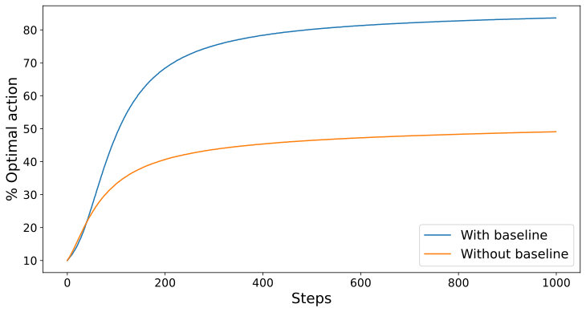
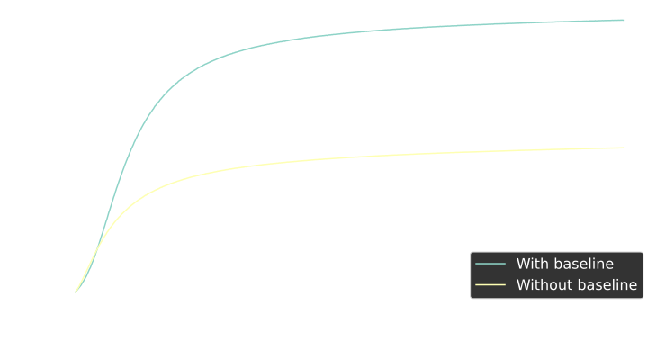

<!-- NOT DONE YET!!! -->
 # Introduction

A common approach to select the optimal action is to compute their action-value for each action and select the one with the highest value. However, this method typically relies on epsilon-greedy exploration, which introduces random guessing during exploration. Instead, we aim to evaluate actions with a probability distribution, enabling the agent to explore each action in proportion to their potential.

# Gradient Bandits

We start by replacing $Q_t(a)$, the action-value function, with a numerical *preference*, which we denote $H_t(a) \in \mathbb R$. The larger the preference, the more the action is favoured, but it has no interpretation in terms of expected reward. As these preferences represent relative scores rather than reward estimates, they can be treated as logits and passed through a softmax function to produce a probability distribution over actions, where only the differences between preferences determine the resulting probabilities. Thus, the probability of choosing each action, defined by our *policy*, $\pi_t(a)$ is $$\begin{equation*}
    \pi_t(a) \doteq \mathrm {P}(A_t = a) \doteq \frac{e^{H_t(a)}}{\sum_{b \in \mathcal A}e^{H_t(b)}}
\end{equation*}$$

# Update rule {#sec:update-rule}

In order to refine our action-preferences, we can use the ideas from stochastic gradient ascent. 
$$
\boxed{\begin{equation*}
\begin{aligned}
    H_{t+1}(A_t) &\doteq H_t(A_t) + \alpha(G_t - \bar{G}_t)(1 - \pi_t(A_t)), && \text{and} \\
    H_{t+1}(a) &\doteq H_t(a) - \alpha(G_t - \bar{G}_t)\pi_t(a), && \forall a \neq A_t,
\end{aligned}
\end{equation*}}
$$

In *exact* gradient ascent, each action preference is incremented in proprotion to the increment's impact on expected returns.

$$H_{t+1}(a) \doteq H_t(a) + \alpha \frac{\partial \mathbb E[G_t]}{\partial H_t(a)}$$ 
where $\alpha \in \mathbb R^+$ is the step size, and $G_t$ is the discounted sum of future rewards. (Or $R_t$ in the Gradient Bandit problem).

We want to solve for gradient term.
$$
\begin{aligned}
\frac{\partial \mathbb E[G_t]}{\partial H_t(a)}
&= \frac{\partial }{\partial H_t(a)} \sum_{A_t} \pi_t(A_t) G_t \\
&= \frac{\partial }{\partial H_t(a)} \sum_{A_t} \pi_t(A_t) q_*(A_t) \\
&= \sum_{A_t} q_*(A_t)\frac{\partial }{\partial H_t(a)}  \pi_t(A_t)
\end{aligned}
$$

Since $\sum_{A_t} \pi_t(A_t) = 1$, we can introduce an arbitrary constant.

$$
\begin{aligned}
&= \sum_{A_t} q_*(A_t)\frac{\partial }{\partial H_t(a)}  \pi_t(A_t) - B_t \frac{\partial \sum_{A_t} \pi_t(A_t)}{\partial H_t(a)} \\
&= \sum_{A_t} \left( q_*(A_t) - B_t \right)
\frac{\partial }{\partial H_t(a)}  \pi_t(A_t)
\end{aligned}
$$

Here $B_t$, the *baseline*, can be any scalar independent of $A_t$.  
To reduce variance, we choose $B_t = \bar G_t$, the running average of observed returns.

Next, we rewrite the sum over actions as an expectation with respect to the distribution of $A_t$ , allowing us the estimate the gradient through sampling and perform stochastic gradient ascent. To do this, we apply the log-derivative trick.
$$
\begin{aligned}
&= \sum_{A_t} \pi_t(A_t)
\left( q_*(A_t) - \bar G_t \right)
\frac{\partial \log \pi_t(A_t)}{\partial H_t(a)} \\
&= \mathbb E_{A_t \sim \pi}
\left[
\left( q_*(A_t) - \bar G_t \right)
\frac{\partial \log \pi_t(A_t)}{\partial H_t(a)}
\right] \\
&= \mathbb E_{A_t \sim \pi}
\left[
\left(
\mathbb E_{A_t \sim \pi}[G_t \mid A_t] - \bar G_t
\right)
\frac{\partial \log \pi_t(A_t)}{\partial H_t(a)}
\right] \\
&= \mathbb E_{A_t \sim \pi}
\left[
\left( G_t - \bar G_t \right)
\frac{\partial \log \pi_t(A_t)}{\partial H_t(a)}
\right]
\end{aligned}
$$
Solving the derivative
$$\begin{align*}
    \frac{\partial \log \pi_t(A_t)}{\partial H_t(a)} &=   \frac{\partial}{\partial H_t(A_t)} \log \left( \frac{e^{H_t(A_t)}}{\sum_{b \in \mathcal A}e^{H_t(b)}} \right) \notag\\
    &=  \frac{\partial}{\partial H_t(a)} \left( H_t(A_t) - \log \sum_{b \in \mathcal A}e^{H_t(b)} \right) \notag\\
    &= \mathbf 1_{A_t=a} - \frac{1}{\sum_{b \in \mathcal A}e^{H_t(b)}} \frac{\partial  \sum_{b \in \mathcal A}e^{H_t(b)}}{\partial H_t(a)} \notag\\
    &= \mathbf 1_{A_t=a} - \frac{e^{H_t(a)}}{\sum_{b \in \mathcal A}e^{H_t(b)}} \notag\\
    &= \mathbf 1_{A_t=a} - \pi_t(a)
\end{align*}$$
Hence
$$\begin{equation*}
     \frac{\partial \mathbb E[G_t]}{\partial H_t(a)} = \mathbb E_{A_t \sim \pi} \left[ \left( G_t- \bar G_t \right)\left( \mathbf 1_{A_t=a} - \pi_t(a) \right)\right]
\end{equation*}$$
As we do not have access to the full expectation, we use a single sample to estimate it. 
$$\begin{align*}
    H_t(a) &= H_t(a) + \alpha \; \mathbb E_{A_t \sim \pi} \left[ \left( G_t- \bar G_t \right)\left( \mathbf 1_{A_t=a} - \pi_t(a) \right)\right] \notag \\
    &= H_t(a) + \alpha  \left( G_t- \bar G_t \right)\left( \mathbf 1_{A_t=a} - \pi_t(a) \right)
\end{align*}$$
Splitting the cases
$$\begin{equation*}
\begin{aligned}
    H_{t+1}(A_t) &= H_t(A_t) + \alpha(G_t - \bar{G}_t)(1 - \pi_t(A_t)), && \text{and} \\
    H_{t+1}(a) &= H_t(a) - \alpha(G_t - \bar{G}_t)\pi_t(a), && \forall a \neq A_t, \tag*{Q.E.D.}
\end{aligned}
\end{equation*}$$


# Baseline

In [section 3](#sec:update-rule), we chose $\bar G_t$ as the baseline. If the expected sum of future rewards is higher than the baseline, the preference and probability of taking action $A_t$ increases, and if the expected sum of future rewards is below baseline, then the preference and probability would decrease. The non-selected actions move in the opposite direction.

To illustrate the purpose of the baseline, [Figure 1](#fig:1) shows results with the gradient bandit algorithm on a variant of the 10-armed bandit problem in which the true expected rewards were selected according to a normal distribution with a mean of $+4$ instead of zero. This biasing of rewards has no effect on the gradient bandit algorithm because of the reward baseline term. But if the baseline were omitted, then performance would be significantly degraded.

<figure id="fig:1">
  

  

  <figcaption style="text-align:center;">
    <strong>Figure 1:</strong> Performance of the gradient bandit algorithm with and without a
baseline, with $\alpha = 0.1$, averaged over 1 million runs.  </figcaption>
</figure>

<!-- NEED TO EXPLAIN WHY THE VARIANCE IS WHAT THE VARIANCE IS -->

# Conclusion

Gradient algorithms provide an alternative way to evaluate actions based on the environment's rewards. Rather than estimating expected rewards directly, they assign preferences to actions and select them probabilistically using a softmax distribution. These preferences are updated via gradient ascent, allowing the agent to favour more promising actions while still exploring. This approach forms the foundation for a whole class of reinforcement learning algorithms and serves as the baseline for more advanced methods such as REINFORCE.

# Appendix

## Log-derivative trick {#sec:log-derivative-trick}

Recall that
$$\begin{gather}
    \nabla_x \log f(x) = \frac{\nabla_x f(x)}{f(x)} \notag
\end{gather}$$
Hence
    $$\nabla_x f(x) = f(x) \nabla_x \log f(x)$$

## Code used for graph
```python
import numpy as np
import torch
from tqdm import tqdm
import pickle
from pathlib import Path
import matplotlib.pyplot as plt
from typing import Self, Optional, Dict


class Bandit:
    def __init__(self,mean, H_init, runs, steps, k, alpha, device = "cpu"):
        """
        :param mean: Mean of distribution which each arm's expected value is drawn from  
        :type mean: int
        :param H_init: Initial action-prefrence
        :type H_init: int
        :param runs: Number of runs to average over
        :type runs: int
        :param steps: time steps to simulate before stopping
        :type steps: int
        :param k: Number of arms
        :type k: int
        :param alpha: Step size
        :type alpha: int
        """
        self.device = device

        self.H_init = H_init
        self.mean = mean
        self.q_true = torch.normal(self.mean, 1, (runs, k), dtype=torch.float32, device=self.device)
        self.H = torch.full((runs, k), self.H_init, dtype=torch.float32, device=self.device)

        self.optimal_arm = torch.argmax(self.q_true, dim=1)
        self.optimal_action = torch.zeros(steps, device=self.device)

        self.runs = runs
        self.steps = steps
        self.k = k
        self.alpha = alpha        

        self.avg_rewards = torch.zeros(self.steps, device=self.device)
        
    def train(self) -> Self:
        """
        The method records:
            - the average reward obtained at each step (`self.rewards`)
            - the fraction of optimal actions selected (`self.optimal_action`)

        The simulation runs across `self.runs` independent bandit problems,
        each with `self.k` arms, for `self.steps` time steps.
        """

        print(f"Running on {self.device}")
        idx = torch.arange(self.runs, device=self.device)
        avg_rewards = torch.zeros(self.runs, device=self.device)

        for t in tqdm(range(self.steps)):

            probs = torch.softmax(self.H, dim=1)
            actions = torch.distributions.Categorical(probs).sample()

            rewards = torch.normal(self.q_true[idx, actions], 1)

            advantage = rewards - avg_rewards

            self.H -= self.alpha * advantage.unsqueeze(1) * probs
            self.H[idx, actions] += self.alpha * advantage

            avg_rewards += (rewards - avg_rewards) / (t + 1)

            self.avg_rewards[t]  = rewards.mean()
            self.optimal_action[t] = torch.mean((actions == self.optimal_arm).float())

        return self
    
    def train_without_baseline(self) -> Self:
        """
        The method records:
            - the average reward obtained at each step (`self.rewards`)
            - the fraction of optimal actions selected (`self.optimal_action`)

        The simulation runs across `self.runs` independent bandit problems,
        each with `self.k` arms, for `self.steps` time steps.
        """

        print(f"Running on {self.device}")
        idx = torch.arange(self.runs, device=self.device)

        for t in tqdm(range(self.steps)):

            probs = torch.softmax(self.H, dim=1)
            actions = torch.distributions.Categorical(probs).sample()

            rewards = torch.normal(self.q_true[idx, actions], 1)

            advantage = rewards 

            self.H -= self.alpha * advantage.unsqueeze(1) * probs
            self.H[idx, actions] += self.alpha * advantage

            self.avg_rewards[t]  = rewards.mean()
            self.optimal_action[t] = torch.mean((actions == self.optimal_arm).float())

        return self
            
    
    def pickle_data(self, path):
        path = Path(path)
        with open(path, "wb") as f:
            pickle.dump(self, f)

    def load_model(self,path):
        path = Path(path)
        with open(path, "rb") as f:
            self = pickle.load(f)

    def reset(self):
        """
        Reset the bandit to its initial state by reinitializing all parameters
        and statistics using the original constructor arguments.
        """
        self = Bandit(self.H_init,self.mean,self.runs,self.steps,self.k, self.alpha)


def plot(
    data: Dict[str, list], 
    xlabel: str = "Steps", 
    ylabel: str = "y", 
):
    """
    Plots multiple datasets and optionally saves them in light and dark styles.

    Parameters:
    -----------
    data : dict
        Dictionary where keys are labels and values are lists of data points.
        Example: {'experiment1': [1,2,3], 'experiment2': [4,5,6]}
    xlabel : str
        Label for the x-axis.
    ylabel : str
        Label for the y-axis.
    """

    def _plot(style: str):
        """Internal function to plot the data with a given style."""
        plt.figure(figsize=(12, 6))
        plt.xlabel(xlabel, fontsize=18)
        plt.ylabel(ylabel, fontsize=18)
        plt.xticks(fontsize=14)
        plt.yticks(fontsize=14)

        for label, d in data.items():
            plt.plot(d, label=label)
        plt.legend(fontsize=16)


    plt.show()


if __name__ == "__main__": 
    conditions = {
    "mean": 4,
    "H_init" : 0,
    "runs" : 1_000_000,
    "steps" : 1000,
    "k" : 10,
    "alpha" : 0.1
    }

    device = "cuda" if torch.cuda.is_available() else "cpu"
    model_with_baseline = Bandit(**conditions, device=device)
    model_without_baseline = Bandit(**conditions, device=device)
    
    model_with_baseline.train()
    model_without_baseline.train_without_baseline()

    data = {
        "With baseline": model_with_baseline.avg_rewards.tolist(),
        "Without baseline": model_without_baseline.avg_rewards.tolist()
    }
    plot(data,ylabel="Average reward")

    
    data = {
        "With baseline": (model_with_baseline.optimal_action * 100).tolist() ,
        "Without baseline": (model_without_baseline.optimal_action * 100).tolist()
    }
    plot(data,ylabel="% Optimal action")
```
