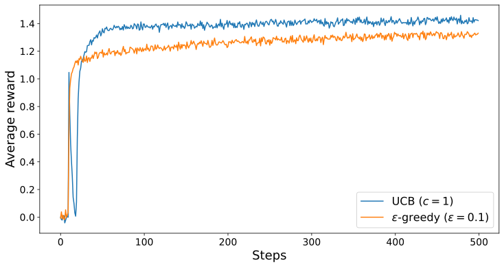
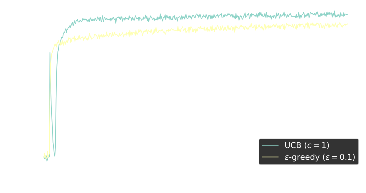
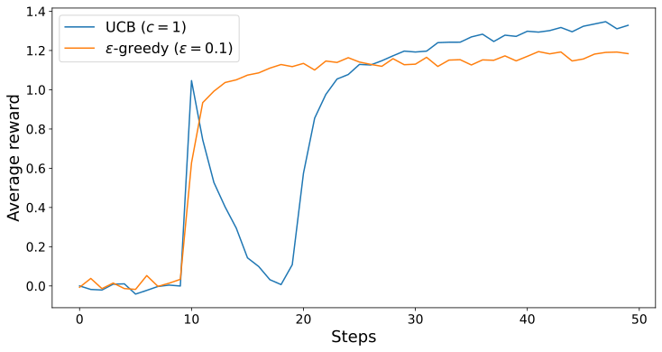
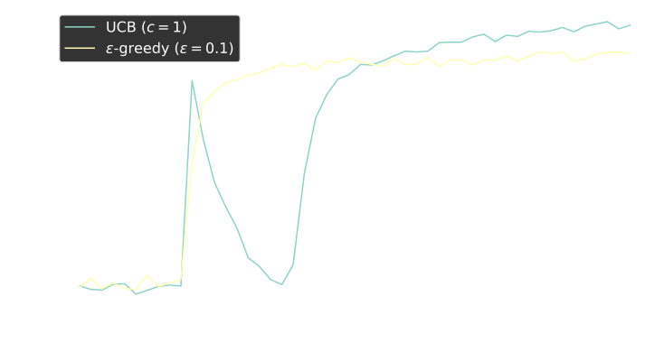
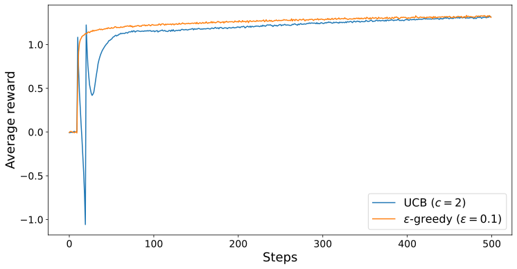
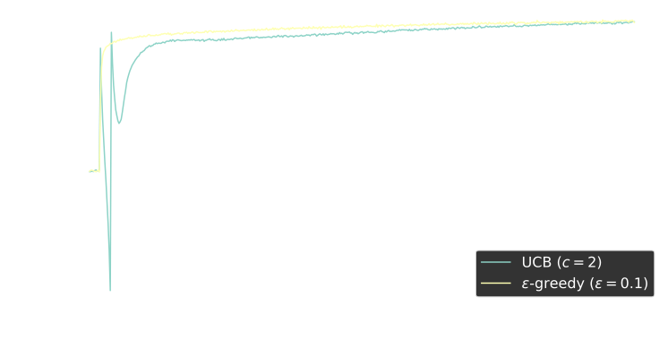
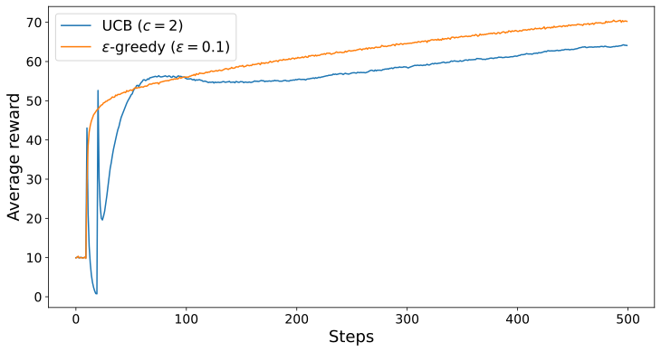
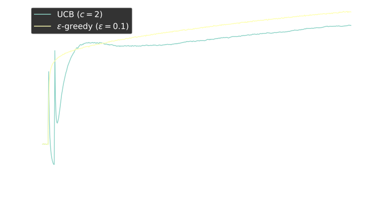

# Introduction

The commonly used epsilon-greedy methods has a significant drawback --- it explores a random action with no consideration of its likelihood to be the optimal actions. It would be better to selectively explore actions according to their potential to be optimal, based on their current action value and its associated uncertainties.

# UCB

UCB attempts to mitigate this issue through the addition of an uncertainty term, to form a *maximising* action. The action selection becomes $$A_t \doteq \underset{a}{\text{argmax}} \left[ Q_t(a) + c \sqrt{\frac{\ln t}{N_t(a)}} \right]$$ where $Q_t(a)$ denotes the action value at time step $t$, $N_t(a)$ denotes the number of times action $a$ has been selected prior to $t$, and $c >0$ controls the degree of exploration. If $N_t(a) = 0$, then $a$ is considered to be a maximising action.

The idea of UCB is that the square root term represents the uncertainty in the action-value estimate. The quantity being argmaxed over becomes sort of upper bound on $Q(a)$ [^1], with $c$ determining the confidence level. Each time $a$ is selected, the uncertainty reduces. On the other hand, each time an action other than $a$ is selected, $\ln t$ increases, increasing the uncertainty. With the logarithm, increases in uncertainty get smaller over time, while remaining unbounded, causing all actions to be selected in future time steps, regardless of the current time step.

<figure id="fig:1">
  

  

  <figcaption style="text-align:center;">
    <strong>Figure 1:</strong> The effect of UCB on the 10-armed bandit problem, averaged over 5000 runs. Both methods used a constant step size $\alpha = 0.1$.
  </figcaption>
</figure>

<!-- TO EXPLAIN WHY WE USE THE SQRT -->

# Exercise

#### Initial spike.

The results in Figure 1 should be quite reliable because they are averaged over 5000 individual, independent 10-armed bandit tasks. Explain the oscillations in the early part of the UCB curve, particularly at the 11th time step where the average reward jumps to $1.1$. Note that for your explanation to be complete, it must explain why the rewards increases on the 11th step and decreases on the subsequent steps.

<figure id="fig:2">
  

  

  <figcaption style="text-align:center;">
    <strong>Figure 2:</strong> Zoomed-in view of the results shown in <a href="#fig:1">Figure 1</a>
  </figcaption>
</figure>

#### Observation.

By examining the nature in which UCB performs action selection, hypothesise how the $\varepsilon$-greedy method has a higher % Optimal action than UCB but a lower average reward. [^2]

<figure data-latex-placement="H">
  <figure>
    
    
    <figcaption style="text-align:center;"></figcaption>
  </figure>

  <figure>
    
    
    <figcaption style="text-align:center;"></figcaption>
  </figure>
</figure>

<figcaption  style="text-align:center;">  <strong>Figure 3:</strong> UCB versus <span class="math inline"><em>ε</em></span>-greedy on different axes, averaged over 50 000 runs. Both methods used a constant step size <span class="math inline"><em>α</em> = 0.1</span></figcaption>
</figure>

# Conclusion

UCB is an excellent way to handle the explore-exploit trade-off. However, it is much more difficult than $\varepsilon$-greedy methods to extend beyond bandits into the general non-stationary case. Another difficulty arises when dealing with large state spaces, particularly when dealing with function approximation. For these reasons, UCB is a powerful tool, but is typically not practical in more advanced settings.

# Appendix

## Answers to Exercise questions

#### Initial spike.

At time step 10, the agent has tried each action exactly once. Hence, the uncertainty term on all actions are equal, which allows the agent to choose the action with the highest action value at time step 11. After time step 11, the uncertainty term on the high action value decrease, prompting the agent to choose actions with lower action values. This phenomenon repeats, prompting the agent to choose worse actions each time, until the $N_t(a)$ term becomes larger and the changes in uncertainty term become less extreme.

#### Observation. 

Even though the $\varepsilon$-greedy method has a higher chance of choosing the optimal action. UCB's exploration is targeted toward actions that are near optimal, which provides high rewards. Averaged out, UCB's exploration is less costly to the agent than the random exploration in the $\varepsilon$-greedy method.

Note that in the long run, UCB tends to outperform the $\varepsilon$-greedy method

<figure data-latex-placement="H">
  <figure>
    
    
    <figcaption style="text-align:center;">
      <strong>Figure 4</strong>
    </figcaption>
  </figure>

  <figure>
    
    
    <figcaption style="text-align:center;">
      <strong>Figure 5</strong>
    </figcaption>
  </figure>
</figure>
<figcaption  style="text-align:center;">UCB performs better than <span class="math inline"><em>ε</em></span>-greedy on both axes in the long run. The data is averaged over 50 000 runs, with a constant step size <span class="math inline"><em>α</em> = 0.1</span></figcaption>
</figure>

## Simulation code

Simulator
```python
import numpy as np
from tqdm import tqdm
import pickle
from pathlib import Path
import matplotlib.pyplot as plt

class Bandit:
    def __init__(self,Q_init, runs, steps, k, alpha):
        """
        :param Q_init: Initial action-values
        :type Q_init: int
        :param runs: Number of runs to average over
        :type runs: int
        :param steps: time steps to simulate before stopping
        :type steps: int
        :param k: Number of arms
        :type k: int
        :param alpha: Step size
        :type alpha: int
        """
        self.Q_init = Q_init
        self.q_true = np.random.normal(0, 1, (runs, k))
        self.Q = np.full((runs, k), self.Q_init, dtype=np.float32)

        self.optimal_arm = np.argmax(self.q_true, axis=1)
        self.optimal_action = np.zeros(steps)

        self.runs = runs
        self.steps = steps
        self.k = k
        self.alpha = alpha

        self.avg_rewards = np.zeros(self.steps)
        
    def train(self,c,epsilon) -> None:
        """ Run the bandit simulation using a hybrid ε-greedy + UCB action selection strategy.

        At each time step, the agent either explores with probability `epsilon`
        by selecting a random arm, or exploits by selecting the arm with the
        highest Upper Confidence Bound (UCB) score. Arms that have not yet been
        selected are forced to be tried by assigning them infinite priority in
        the argmax step.

        The method records:
            - the average reward obtained at each step (`self.rewards`)
            - the fraction of optimal actions selected (`self.optimal_action`)

        The simulation runs across `self.runs` independent bandit problems,
        each with `self.k` arms, for `self.steps` time steps.
        """

        n_action_selected = np.zeros((self.runs,self.k))

        for t in tqdm(range(self.steps)):

            explore = np.random.rand(self.runs) < epsilon

            
            picked = n_action_selected != 0

            action_scores = self.Q + c * np.sqrt(np.log(t+1)/n_action_selected)

            # If we have not picked an option, we want to pick it next
            Actions = np.argmax(np.where(picked, action_scores, np.inf), axis=-1)

            random_actions = np.random.randint(self.k, size=self.runs)
            actions = np.where(explore, random_actions, Actions)


            n_action_selected[np.arange(self.runs), actions] += 1


            rewards = np.random.normal(self.q_true[np.arange(self.runs), actions], 1)

            self.avg_rewards[t]  = rewards.mean()

            self.Q[np.arange(self.runs), actions] += self.alpha * (
                rewards - self.Q[np.arange(self.runs), actions]
            )

            self.optimal_action[t] = np.mean(actions == self.optimal_arm)
            
    
    def pickle_data(self, path):
        path = Path(path)
        with open(path, "wb") as f:
            pickle.dump(self, f)

    def load_model(self,path):
        path = Path(path)
        with open(path, "rb") as f:
            self = pickle.load(f)

    def reset(self):
        """
        Reset the bandit to its initial state by reinitializing all parameters
        and statistics using the original constructor arguments.
        """
        self = Bandit(self.Q_init,self.runs,self.steps,self.k, self.alpha)


if __name__ == "__main__":
    runs = 5000
    steps = 500
    k = 10
    alpha = 0.1


    eps_greedy = Bandit(0, runs, steps, k, alpha)
    eps_greedy.train(c=0, epsilon=0.1)

    ucb = Bandit(0, runs, steps, k, alpha)
    ucb.train(c=1, epsilon=0)
```


[^1]: Technically, the upper bound of an action-value estimate is always $\infty$. However, by adjusting $c$, we can ensure that the true mean $q_*$ is less than or equal to our upper bound with probability $P = 1- t^{-2c}$

[^2]: UCB tends to perform better than $\varepsilon$-greedy methods, both in terms of average reward and % Optimal action. Make your hypothesis based on the provided data.

